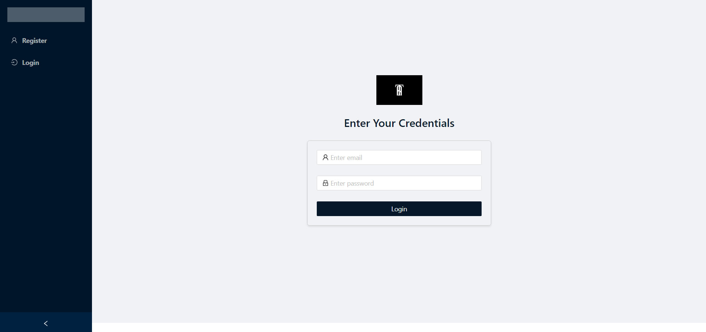
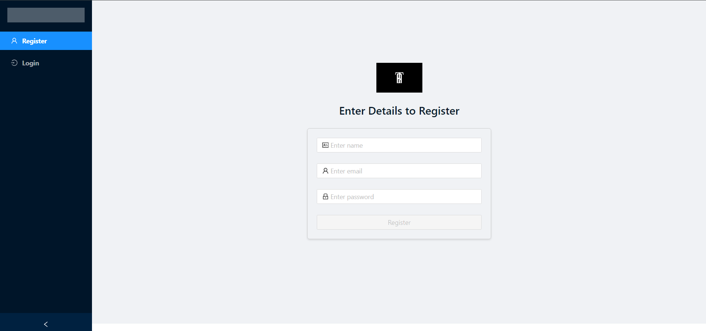
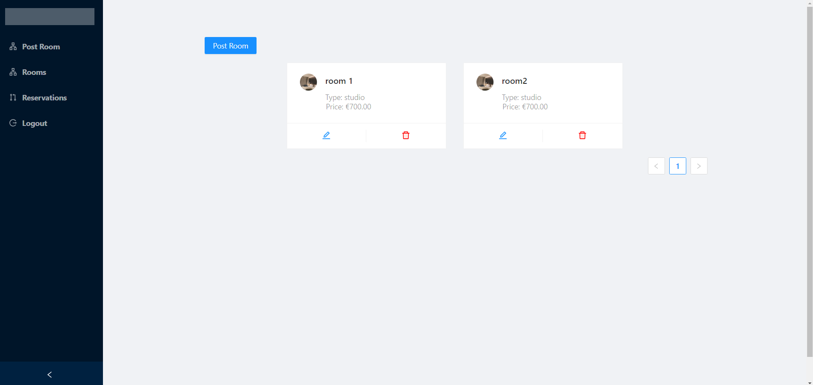
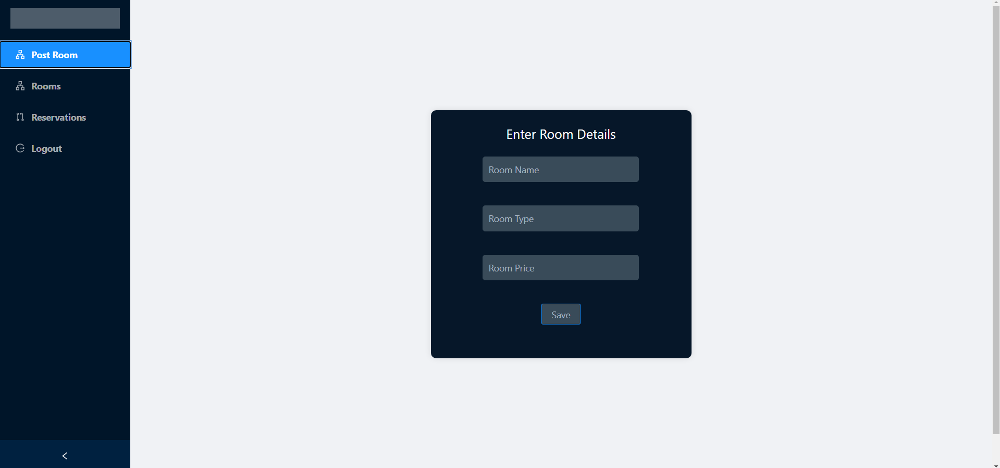
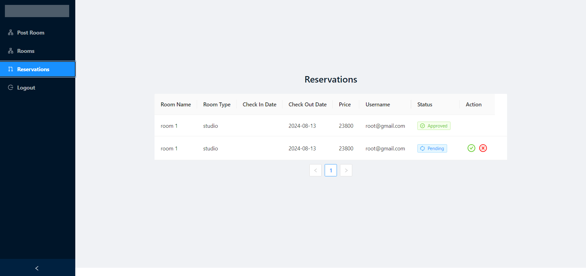
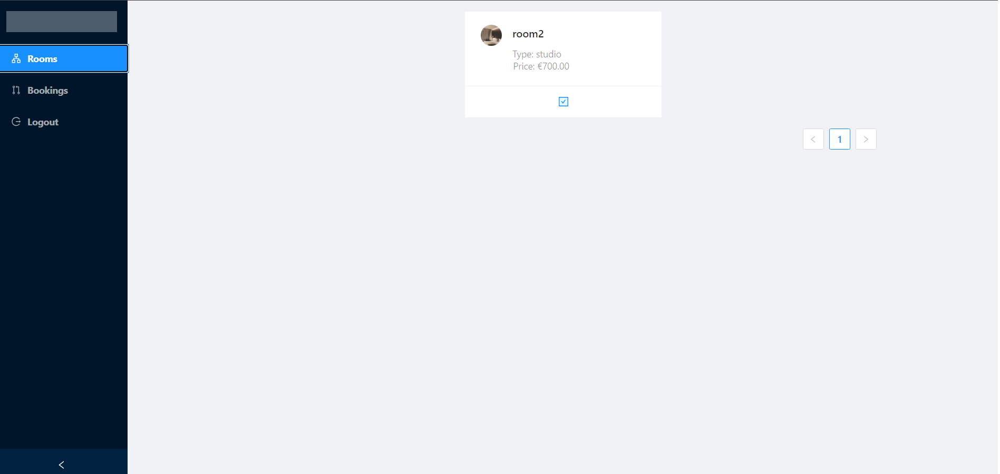

# Full Stack: Hotel Management System

This is a simple full stack project based on Spring Boot / Java for the back end and Angular for the front end.

## Features

- **Login / Registration**
- **User Authentication / Authorization**: Utilizes Spring Security and JSON Web Tokens.
- **Customer's Booked Rooms**: List of booked rooms with pagination.
- **Customer's Bookings**: List of bookings showing different reservation statuses, with pagination.
- **Admin Post Room**: Allows administrators to register a new room.
- **Admin's Rooms**: List of rooms with pagination.
- **Admin's Reservations**: List of reservations displaying different statuses and actions (approve or reject), with pagination.
- **Form validations**: Includes form validations.

## Technologies 

- Angular: 15.2.11
- Apache Maven
- Hibernate
- Spring Boot 3.2.8
- Spring Data
- Spring core
- Spring security
- Java 17
- jjwt-api
- Typescript
- Ng-zorro
- MySQL

## Interfaces 

### Login

### Register

### Rooms / admin

### Post room / admin

### Reservations / admin

### Rooms / customer

### Bookings / customer

## Demo
[Link to video Demo](https://www.youtube.com/watch?v=WjJQ25zMDQE)
